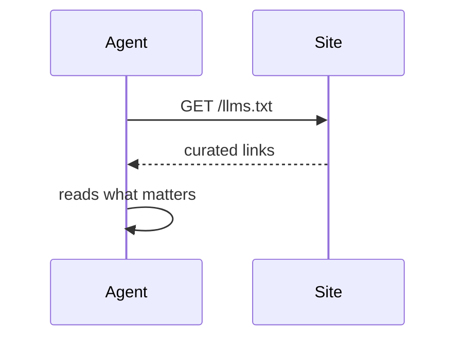
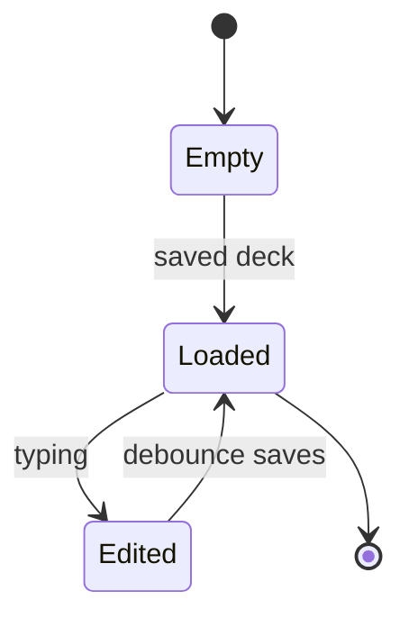

The v2 capabilities on one deck: bigger bullets, remote and local images, more diagram types, and a 1-heading, two-column slide. This file lives at apps/md2slides/examples/capabilities.md.

# Images — from the web

A remote image is a normal Markdown image: ``. It loads straight from the URL.

# Images — local files

Reference a file by relative path, same syntax. Drop `logo.png` in the `examples/images/` folder and open this deck there.

# A diagram, sequence

Sequence diagrams show actors and messages instead of boxes and arrows.

# A diagram, state

State diagrams track change over time — here, the editor's own life cycle.

# One heading, two columns

Under a single `#` heading add exactly two `##` sub-headings. The card splits into a grid. Lead text above the first `##` stays above the columns.

## What agents read

- robots.txt — a boundary
- llms.txt — a map
- HTML — the pages

## What sites do now

- Optimize to be cited
- Publish llms.txt
- Serve agents directly

# Your turn

Delete this and ship your own deck.