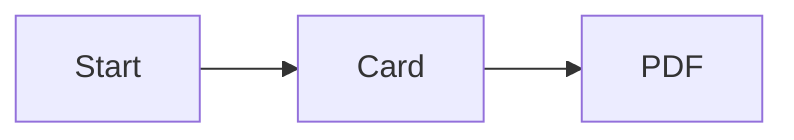

Everything you type in the left pane is Markdown. A `#` heading on its own line opens a new card. Each card below shows the source in a code block — and, when it helps, the thing that code makes.

# What Markdown looks like

Five marks carry most of the work.

```
# a heading
- a bullet
**bold** and *italic* and `code`
[text](https://example.com)
```

# Headings

A `#` at the very start of a line — one space after it, then your title — opens a new card.

```
# This line becomes the next card's title
```

Inside a card, `##` makes a smaller sub-heading. Two `##` on the same card split the body into two columns.

# Bold, italic and code

Wrap text in the marks, with no spaces inside.

```
**bold**
*italic*
`inline code`
```

Rendered: **bold**, *italic*, and `inline code`.

# Links

Square brackets for the words, round brackets for the address.

```
[llms.txt](https://llmstxt.org/)
```

[llms.txt](https://llmstxt.org/) — it opens in a new tab and stays clickable in the exported PDF.

# Images

An image is a link with an exclamation mark in front: ``.

```

```


# Lists

A dash starts a bullet; a number starts an ordered list.

```
- one
- two
1. first
2. second
```

- one
- two

# Quotes and rules

A `>` makes a blockquote. Three dashes on a line of their own make a horizontal rule.

```
> a short quote
---
```

> A short quote.

---

# Code blocks

Wrap several lines in three backticks: the marks above and below the code, no other characters on those lines.

```
print("hello from a code block")
```

The block you are reading is itself a code block — the app keeps its content verbatim.

# Diagrams with Mermaid

A fence tagged `mermaid` is drawn as a diagram instead of shown as code. Write the word `mermaid` right after the opening backticks. Here is such a fence as plain text:

```
flowchart LR
  A[Start] --> B[Card] --> C[PDF]
```

# Diagrams — rendered

That same source, given a `mermaid` tag, renders as a diagram.



# Two columns, without HTML

Under a single `#` heading, a pair of `##` sub-headings splits the body into two columns. The count is the trigger — no HTML and no extra `#`.

## Left column

- Write the left column here

## Right column

- And the right one here

# The title card

The first block, between the `---` lines, is the title card's frontmatter: `title:` names the slide, and the text below the block becomes its subtitle.

```
---
title: My first deck
closing: auto
---
```

Everything above the first `#` heading is the title card's subtitle.

# Closing card and shortcuts

The last `#` becomes a centered closing card. Whatever you write: press `/` in slideshow mode to search every card, drag the divider to resize the preview, `z` for zen, `v` for slides-only, `s` to present.

# Your turn

Now write your own deck. One `#` heading and one `-` bullet makes a working slide — start there. Open the Examples menu and pick "All features" to see every option the app ships.