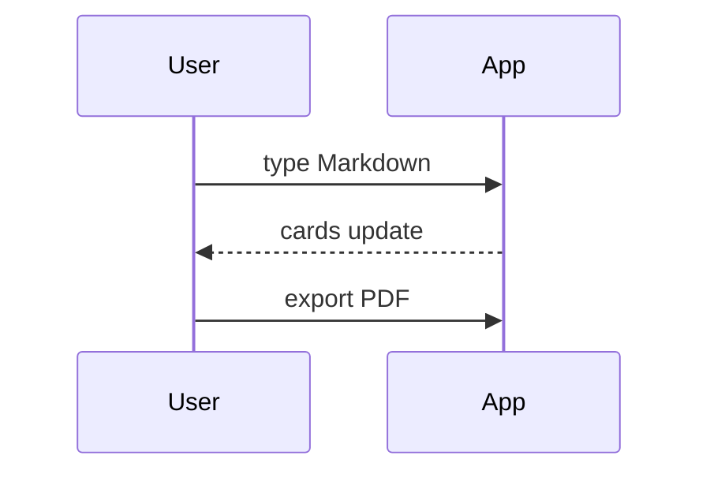
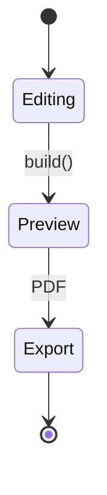

Text above the first heading is the subtitle on the title card. Below it: every feature this app ships, on one scannable deck.

# Text basics

- **Bold**, *italic*, `code`, and ~~struck~~ all render on a card
- [Inline links](https://llmstxt.org/) stay clickable in the preview and the exported PDF
- Bullets and ordered lists both work

1. First ordered item
2. Second ordered item
3. Third ordered item

# Quotes and rules

> One short quote per card, under a line.

---

A horizontal rule separates blocks. It is a rule, not a card break.

# A code fence

Three backticks keep the code verbatim, indentation intact.

```py
def greet(name):
    # fenced, kept exactly as written
    return f"hello {name}"
```

# Diagram — flowchart


# Diagram — sequence



# Diagram — state



# Images — remote

A remote image loads straight from its URL. Paste or drop a file to inline it as a `data:` URI.


# Images — local

A local file sits under the app's `images/` folder; relative paths resolve against the app, not the deck file.


# One heading, two columns

Under a single `#`, add exactly two `##` and the card splits into a grid. Lead text above stays above the columns.

## Left column

- Plan the deck
- Write the spine

## Right column

- Extend and revise
- Export to PDF

# The closing card

The last `#` becomes a centered bookend with no footer. Press `/` in slideshow to search every card here.