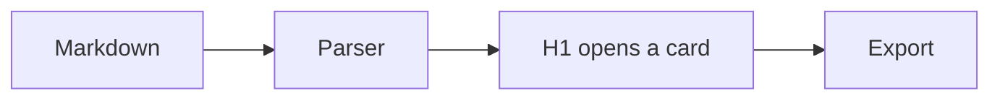
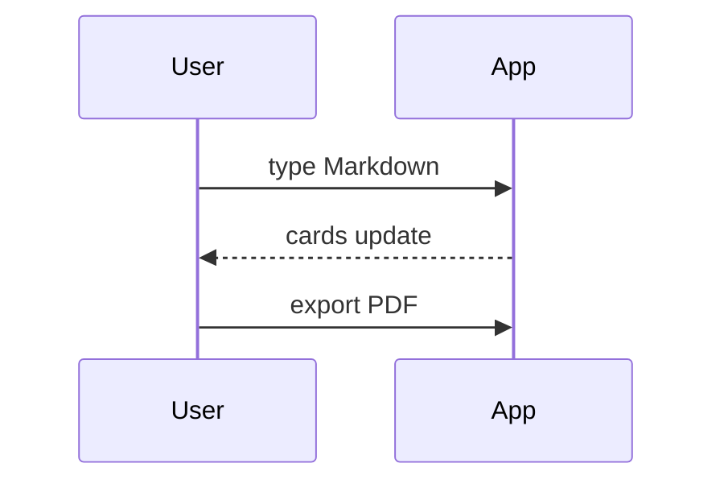
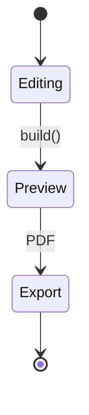

# Next 40-45 mins
## What this talk covers

## What this does not cover
- Mindset
- Browsing and selecting a project
- Small steps first
- Learning the codebase
- Professional growth
- Community engagement

# What is Free Software?

“Free software” means software that respects users' freedom and community. Roughly, it means that the users have the freedom to run, copy, distribute, study, change and improve the software. 

source: https://www.gnu.org/philosophy/free-sw.en.html

# Two stories
## Richart Stallman 

## Linux Torvalds


# Open Source AI
## Open weights

## Open data

## Open Source

## Open Tooling


Welcome to The Open Source Talk (TOST)

Thinking window
- dimensions
  introduction to open source
  - two stories
    - richard stallman
    - linus torvalds
  open source in the context of AI
  - open weights and open data
  how can your open source project skills help you professionally


Text above the first heading is the subtitle on the title card. Below it: every feature the app ships, on one scannable deck.

# Text basics

- **Bold**, *italic*, `code`, and ~~struck~~ all render on a card
- [Inline links](https://llmstxt.org/) stay clickable in the preview and the exported PDF
- Bullets and ordered lists both work

1. First ordered item
2. Second ordered item
3. Third ordered item

> A blockquote, then a horizontal rule below it.

---

# A code fence

```py
def greet(name):
    # a fenced block renders as code, kept verbatim
    return f"hello {name}"
```

# Diagram — flowchart



# Diagram — sequence



# Diagram — state



# Images — remote

A remote image loads straight from its URL.


